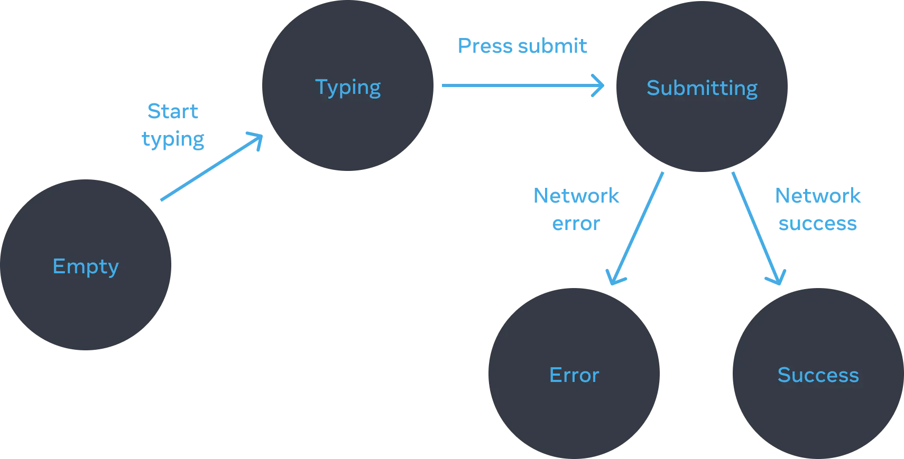

# Reacting to Input with State

### 1. Declarative UI and Imperative UI

1. Imperative: need to write the exact instructions to manipulate the UI.
2. Declarative: declare what to show, and React figures out how to enable / disable ...

### 2. Think about UI Declaratively

1. Identify your component’s different visual states
2. Determine what triggers those state changes
3. Represent the state in memory using useState
4. Remove any non-essential state variables
5. Connect the event handlers to set the state

