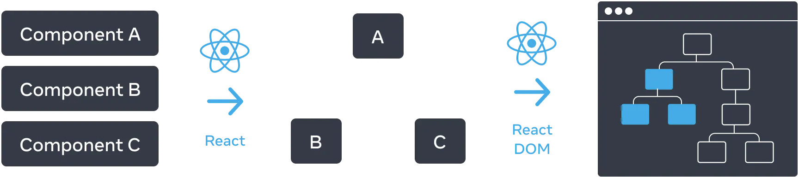
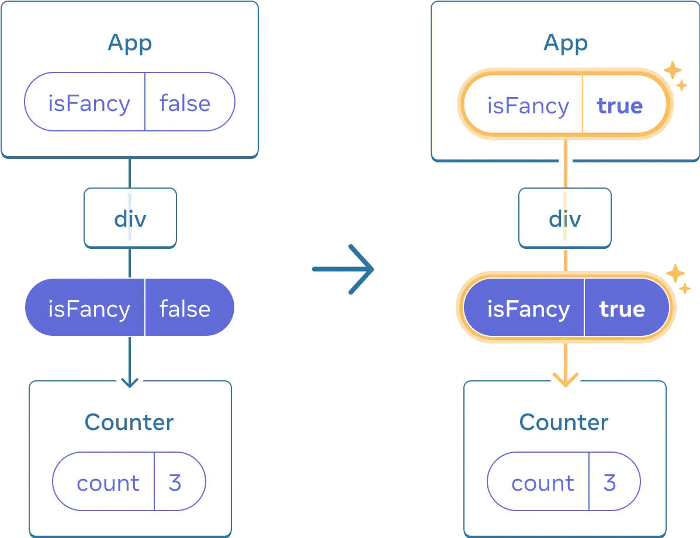
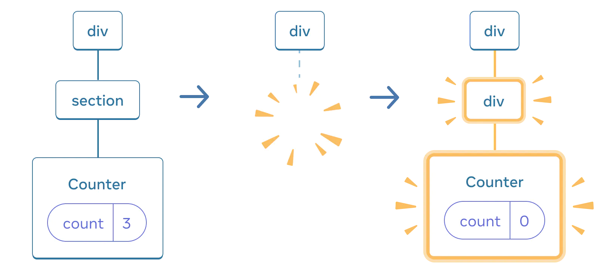
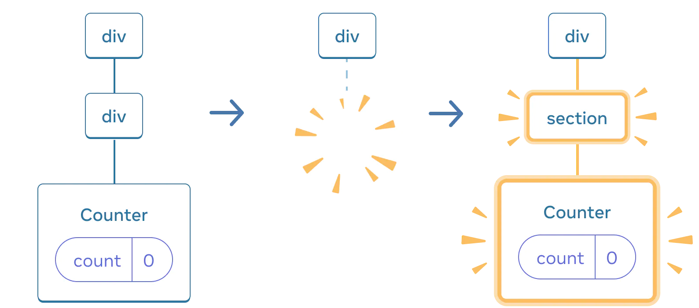

# Preserving and Resetting State

### 1. The UI Tree

1. React makes UI trees from JSX.
2. React DOM updates the browser DOM elements to match that UI tree.
   

### 2. State is Tied to a Position in a Tree

States don't live inside the component, they are held inside React.

### X. Pitfall!

React 拥有一套令人迷惑的匹配机制\
如果 components 的“地址”和“定义”相同, 那么 React 会认定它们是同一个 component, 这意味着如果在 function 组件返回时使用 if
语句, 即使它们逻辑上不同(在代码中的“位置”也不同), 但 React 仍将它们视为相同组件并共享状态!

如果 components 的“定义”不相同, 即使它们处于相同的位置, 它们也不会共享状态, 因为在重渲染过程中旧的 component 会被删除,
此子树的状态会被重置


不要在工程中嵌套函数定义组件, 因为每一次重渲染父组件都会创建一个新组件, (这时候子组件的“名称”相同, 但是“定义”不同(
理解为重新“定义”了一遍)), 所以父组件重渲染时子组件的 state 会丢失

### 3. Reset State at the Same Position
1. Resetting state with a key
```js
{isPlayerA ? (
  <Counter key="A" person="A" />
) : (
  <Counter key="B" person="B" />
)}
```


